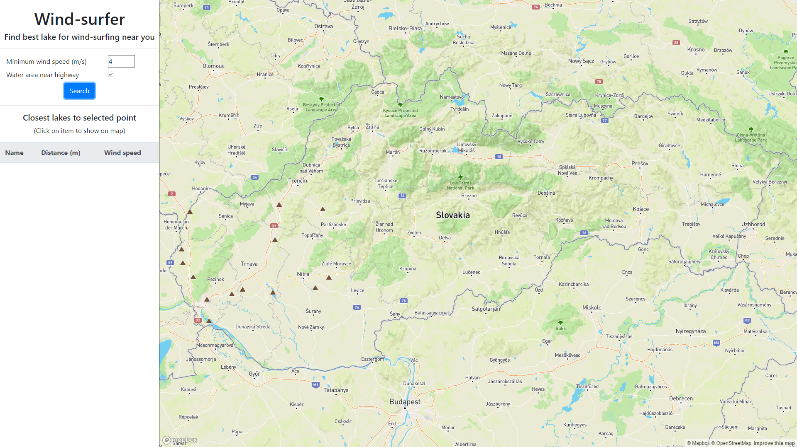

# Overview

Application *WindSurfer* shows lakes and water surfaces in Slovakia with enough area for wind surfing on a map. Most important features are: 

- search by wind speed
- search for lakes near highway
- list closest lakes near selected point on map
- refresh weather

This is it in action:







The application has 2 separate parts, the client which is a [frontend web application](#frontend) using mapbox API and mapbox.js and the [backend application](#backend) written in Python library [CherryPy](https://cherrypy.org), backed by PostGIS. The frontend application communicates with backend using a [REST API](#api).

# Frontend

The frontend application is a static HTML page (`/public/html/index.html`) with Bootstrap 4 styling, which shows sidebar with user interface and a mapbox.js widget. It is displaying lakes, thus the map style is based on the Outdoors style.

All relevant frontend code is in `/public/js/script.js` which is referenced from `index.html`. The frontend code is very simple, its only responsibilities are:

- calling appropriate backend APIs on page load, search or map click to load geojson.
- filling the sidebar panel list with closest lakes to selected point when user clicks on a map and zooms to chosen lake when user clicks on list item.
- displaying geo features as markers with popups by overlaying the map with a geojson layer. The geojson is provided directly by backend APIs.

# Backend

The backend application is written in Python library CherryPy and is responsible for querying geo data, formatting the geojson and communication with weather API.

## Data

Water surfaces data is coming directly from [Open Street Maps](https://www.openstreetmap.org/). I downloaded an extent covering whole Slovakia (around 180MB) and imported it using the `osm2pgsql` tool into the standard OSM schema. To speedup the queries I created an index on columns (`natural` and `water`) in polygons, on column (`place`) in points and on column (`highway`) in roads in addition to automatic GIST index on column(`way`) in all tables. GeoJSON is generated by using a standard `st_asgeojson` function.

Information about weather is taken from [Open Weather Map](https://openweathermap.org) API for all closest towns and cities near lakes and is stored in database.

## Api

**Search for lakes with selected contitions**

`GET /lake_search?wind=0&highway=false`

**Find 7 closest lakes to selected point sorted by proximity**

`GET /closest_lakes?longitude=15&latitude=20`

**Update weather and save it to database**

`GET /update_weather?reset=false`


### Response

API calls `GET /lake_search` and `GET /closest_lakes` return json responses with array of lakes. Each lake entry has following attributes: 

```
{
  "lake_id": 53584095,
  "lake_name": "Virtské jazero",
  "position": {\"type\":\"Point\",\"coordinates\":[18.3150722912499,47.7518395002498]}, # geojson
  "city_name": "Komárno", # closest city
  "city_type": "town",
  "distance": 3089834, # only in GET /closest_lakes
  "wind_speed": 5.7
  "wind_degrees": 110
}
```

API call `GET /update_weather` returns json with `{"status": "ok"}` if it finished correctly.









